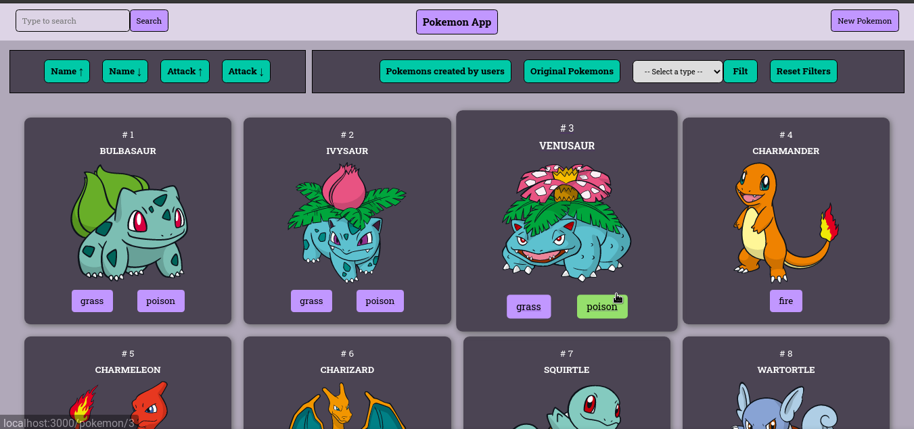
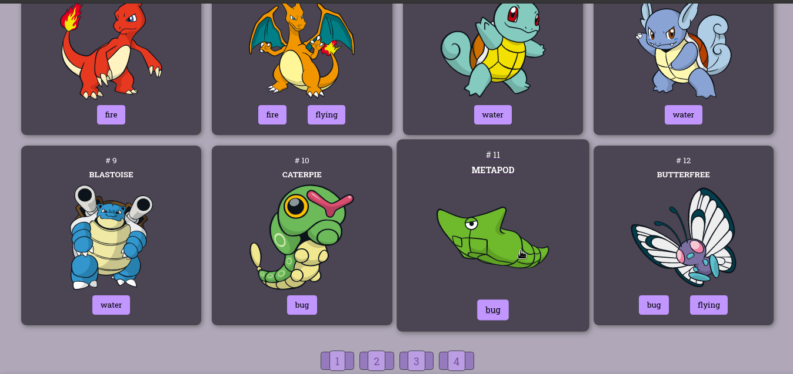
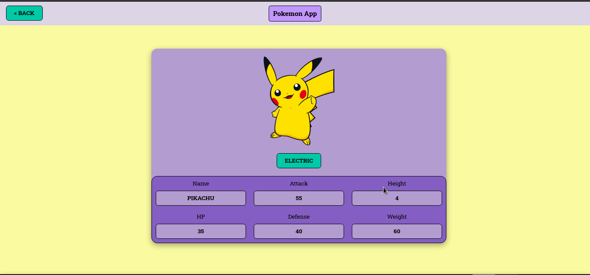
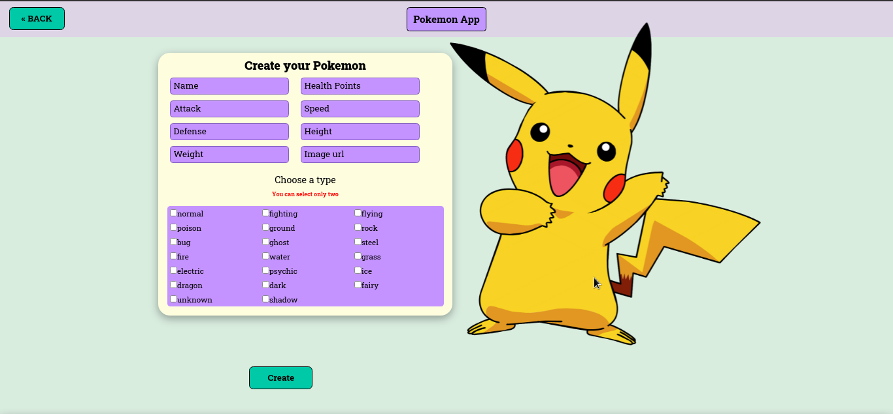

    

# Individual Project - Henry Pokemon App

## TECHNOLOGIES

- React
- Redux
- Node JS
- Sequelize
- Postgress
- Express

## Start the App

 1. npm install
 2. npm start
 3. Enjoy it!

 
## Resume
I built this App in Henry 's Bootcamp using the PokeAPI. You can filter pokemons by name, by attack, sort alphabetically, create your own pokemon or take a look on every pokemon detail.

## What you will see

  

  

  

  

